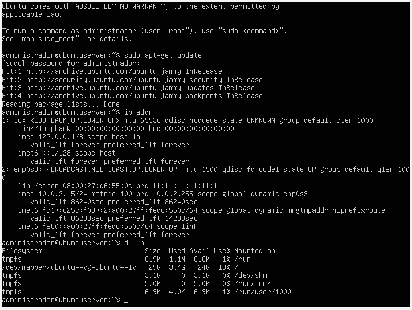

# Relatório Técnico - Aula Prática 01: Introdução à Virtualização e Instalação do Ubuntu Server 26.04 LTS

## 1. Identificação
* **Nome do Aluno:** Arthur Soares Silva
* **Curso:** Bacharelado em Sistemas de Informação (BSI)
* **Turma:** Período 9
* **Data de Execução:** 25/08/2026
* **Título da Prática:** Introdução à Virtualização e Instalação do Ubuntu Server 26.04 LTS

---

## 2. Objetivo
Compreender os conceitos fundamentais de virtualização, hipervisores (Tipo 2) e isolamento de recursos. A prática abrangeu a criação e preparação de uma máquina virtual no Oracle VM VirtualBox, a instalação customizada do sistema operacional de rede Ubuntu Server 26.04 LTS utilizando gerenciamento de volumes lógicos (LVM), a ativação do serviço OpenSSH e a validação do ambiente via linha de comando.

---

## 3. Ambiente
* **Hospedeiro (Host Physical Machine):**
  * **Sistema Operacional:** Windows 11 Pro
  * **Processador:** Intel Core i5 / AMD Ryzen 5
  * **Memória RAM:** 8 GB / 16 GB
* **Virtualizador:** Oracle VM VirtualBox (com Extension Pack instalado)
* **Mídia de Instalação:** `ubuntu-26.04-live-server-amd64.iso`
* **Máquina Virtual (VM Target):**
  * **Nome:** `ubuntu_server`
  * **Diretório:** `C:\2026\BSI\VM\ArthurSoaresSilva\ubuntu_server`
  * **vCPU:** 1 CPU
  * **Memória RAM:** 512 MB
  * **Disco Rígido Virtual:** VDI de 32 GB (Reservado Dinamicamente)
  * **Interface de Rede:** Placa em modo NAT (`enp0s3`)

---

## 4. Procedimento
1. **Organização no Host:** Criação do diretório de originais (`C:\2026\BSI\VM\original`) para armazenamento da imagem ISO e criação do diretório de trabalho do aluno.
2. **Criação da VM:** Configuração de uma nova máquina virtual no VirtualBox especificando o tipo Linux / Ubuntu (64-bit), com 512 MB de RAM e disco VDI dinâmico de 32 GB.
3. **Mídia e Boot:** Anexação da ISO na controladora IDE e inicialização da máquina virtual.
4. **Configurações Iniciais:** Seleção do idioma do instalador em `English`, layout de teclado em `Portuguese (Brazil)` e confirmação da obtenção do endereço IP via DHCP na interface `enp0s3`.
5. **Particionamento LVM Customizado:**
   * Criação da partição `/boot` dedicada de 1 GB (1024M), formatada em `ext4`.
   * Criação de uma partição não formatada (*Leave unformatted*) no espaço restante para alocação de LVM.
   * Criação do Volume Group nomeado `ubuntu-vg`.
   * Criação do Volume Lógico Raiz (`ubuntu-lv`) com 29 GB, formato `ext4` e ponto de montagem `/`.
   * Criação do Volume Lógico de Troca (`swap-lv`) com ~2 GB, formato `swap`.
6. **Credenciais do Sistema:** Configuração do nome do servidor (`ubuntu_server`), nome de usuário (`administrador`) e senha (`adminifal`).
7. **Serviços Adicionais:** Pulo da integração com o Ubuntu Pro e marcação da opção `[X] Install OpenSSH Server` para permitir futuros acessos remotos.

---

## 5. Testes e Evidências
* **Validação de Rede (`ip addr`):** Confirmação de que a interface `enp0s3` obteve com sucesso um endereço IP na faixa do DHCP da rede NAT do VirtualBox (ex: `10.0.2.15/24`).
* **Validação de Particionamento e LVM (`df -h`):** Confirmação de que a partição `/boot` de 1 GB está montada separadamente e de que o volume lógico `/dev/mapper/ubuntu--vg-ubuntu--lv` está devidamente montado na raiz `/` do sistema com o tamanho especificado.
* **Atualização do Repositório (`sudo apt-get update`):** Execução da atualização dos índices do gerenciador de pacotes `apt` com privilégios de superusuário, confirmando o pleno acesso do servidor à internet.

---

## 6. Problemas e Soluções
* **Problema 1: Impossibilidade de concluir o particionamento (Botão `[ Done ]` desativado)**
  * *Sintoma:* Mensagem em vermelho no topo do instalador exibindo `"To continue you need to: Select a boot disk"`.
  * *Solução:* Foi necessário aplicar um *Reset* nas alterações e criar explicitamente uma partição não-LVM de 1 GB formatada em `ext4` com o ponto de montagem `/boot`.
* **Problema 2: Opção `Create volume group (LVM)` desativada (em cinza)**
  * *Sintoma:* Ao tentar criar o grupo LVM diretamente sobre o espaço livre, a opção ficava inacessível e a criação de partição solicitava o campo *Size*.
  * *Solução:* No menu do *free space*, utilizou-se a opção *Add GPT Partition*, definindo o campo *Format* para *Leave unformatted*. A criação prévia dessa partição bruta ativou imediatamente o menu de criação do Volume Group (`ubuntu-vg`).
* **Problema 3: Erro de desmontagem ao reiniciar a VM (`failed unmounting /cdrom`)**
  * *Sintoma:* Durante o processo final de reinicialização (`Reboot Now`), o sistema apresentou uma falha no console ao tentar desmontar o drive de CD-ROM.
  * *Solução:* A mensagem é um comportamento comum no VirtualBox devido à ejetação automática da mídia virtual. O problema foi resolvido pressionando a tecla `Enter` no terminal e efetuando uma reinicialização forçada da máquina virtual (`Ctrl + R`).

---

## 7. Conclusão
Esta prática permitiu entender de forma concreta o funcionamento de um ambiente virtualizado sob um hipervisor de Tipo 2 e a importância do isolamento de recursos do hardware físico. A experiência com a instalação do Ubuntu Server destacou a relevância do Logical Volume Manager (LVM) em ambientes de produção, onde a flexibilidade para redimensionar partições e volumes em disco é fundamental para a administração de redes e servidores. Além disso, a habilitação nativa do OpenSSH garante a infraestrutura necessária para a gestão remota por linha de comando em etapas futuras do curso.
