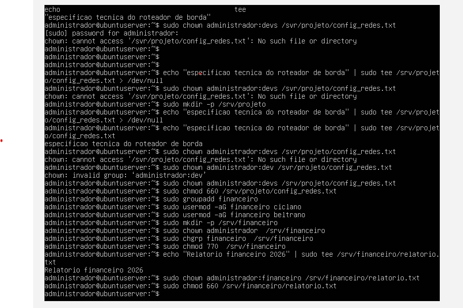

# Relatório Técnico - Aula Prática 02: Administração de Usuários, Grupos e Permissões no Linux

## 1. Identificação
* **Nome do Aluno:** Arthur Soares Silva
* **Curso:** Bacharelado em Sistemas de Informação (BSI)
* **Turma:** Período 9
* **Data de Execução:** 25/08/2026
* **Título da Prática:** Administração de Usuários, Grupos e Permissões no Ubuntu Server 26.04 LTS

---

## 2. Objetivo
Capacitar a administração de contas de usuários, criação e gestão de grupos de trabalho e a definição de políticas de acesso no Linux. A prática aplicou a segregação de funções em diretórios compartilhados (`/srv/projeto` e `/srv/financeiro`) utilizando controle de posse (`chown` e `chgrp`), permissões octais (`chmod 770` e `660`) e validação via troca de contexto com `su -`.

---

## 3. Ambiente
* **Hospedeiro (Host):** Windows 11 Pro
* **Hipervisor:** Oracle VM VirtualBox
* **Sistema Convidado (VM):** Ubuntu Server 26.04 LTS
* **Usuário Administrador:** `administrador` (com privilégios `sudo`)

---

## 4. Procedimento
1. **Criação das Contas de Usuário:**
   * Execução do comando `sudo adduser` para criar as contas: `fulano`, `cicrano`, `beltrano` e `novato`.
2. **Criação e Gestão de Grupos:**
   * Criação do grupo `devs` (`sudo groupadd devs`) e associação dos usuários `fulano`, `cicrano` e `beltrano` (`sudo usermod -aG devs <usuario>`).
   * Criação do grupo `financeiro` (`sudo groupadd financeiro`) e associação dos usuários `cicrano` e `beltrano`.
3. **Configuração da Pasta /srv/projeto:**
   * Criação do diretório garantindo a árvore de caminhos: `sudo mkdir -p /srv/projeto`.
   * Ajuste de posse para o dono `administrador` e grupo `devs`: `sudo chown administrador /srv/projeto` e `sudo chgrp devs /srv/projeto`.
   * Aplicação de permissão octal restritiva: `sudo chmod 770 /srv/projeto` (`drwxrwx---`).
   * Criação do arquivo interno via redirecionamento seguro: `echo "Especificacao tecnica do roteador de borda" | sudo tee /srv/projeto/config_redes.txt`.
   * Ajuste de propriedade e permissão do arquivo: `sudo chown administrador:devs /srv/projeto/config_redes.txt` e `sudo chmod 660 /srv/projeto/config_redes.txt` (`-rw-rw----`).
4. **Exercício de Fixação (/srv/financeiro):**
   * Criação do diretório: `sudo mkdir -p /srv/financeiro`.
   * Definição de posse para o grupo financeiro: `sudo chown administrador:financeiro /srv/financeiro`.
   * Aplicação da permissão octal: `sudo chmod 770 /srv/financeiro`.
   * Criação do arquivo `relatorio.txt` com permissão `660` para acesso exclusivo do grupo `financeiro`.

---

## 5. Testes e Evidências
* **Acesso do Grupo Devs (`fulano` em `/srv/projeto`):**
  * Comando: `su - fulano` -> `cd /srv/projeto` -> `echo "Revisado" >> config_redes.txt`
  * *Resultado:* Leitura e escrita efetuadas com sucesso.
* **Bloqueio de Usuário Sem Acesso (`novato` em `/srv/projeto`):**
  * Comando: `su - novato` -> `cd /srv/projeto`
  * *Resultado:* Retorno imediato de `Permission denied`.
* **Acesso do Grupo Financeiro (`cicrano` em `/srv/financeiro`):**
  * Comando: `su - cicrano` -> `cd /srv/financeiro` -> `cat relatorio.txt`
  * *Resultado:* Acesso permitido com sucesso.
* **Isolamento entre Setores (`fulano` em `/srv/financeiro`):**
  * Comando: `su - fulano` -> `cd /srv/financeiro`
  * *Resultado:* Retorno de `Permission denied`, confirmando o isolamento entre departamentos.

---

## 6. Problemas e Soluções
* **Problema 1: Erro `No such file or directory` ao criar arquivos com `tee` ou alterar posse com `chown`**
  * *Causa:* Tentativa de criar arquivos ou aplicar permissões em caminhos cujos diretórios pai ainda não haviam sido criados no sistema.
  * *Solução:* Execução prévia do comando `sudo mkdir -p <caminho>` para garantir a existência dos diretórios antes da criação dos arquivos.
* **Problema 2: Impossibilidade de colar texto diretamente do Windows para a VM no VirtualBox**
  * *Causa:* Ausência de interface gráfica no Ubuntu Server para a área de transferência compartilhada padrão.
  * *Solução:* Utilização do atalho `Ctrl Direito + V` (Host+V) no VirtualBox para simulação de digitação ou acesso remoto via SSH no PowerShell do Windows.
* **Problema 3: Conflito de permissão ou herança de ambiente durante testes entre usuários**
  * *Causa:* Uso do comando `su usuario` sem o hífen, mantendo o diretório atual e variáveis do usuário anterior.
  * *Solução:* Adoção do comando `su - usuario` com o hífen, forçando o carregamento de uma *login shell* limpa e isolada no diretório home da conta testada.

---

## 7. Conclusão
A prática permitiu vivenciar a aplicação do princípio do menor privilégio em sistemas Linux. A combinação da criação de grupos de trabalho com permissões octais bem estruturadas (`770` para diretórios e `660` para arquivos) provou ser um método eficaz para garantir a colaboração interna entre membros de uma mesma equipe, mantendo o isolamento rígido contra acessos não autorizados de outros setores.
