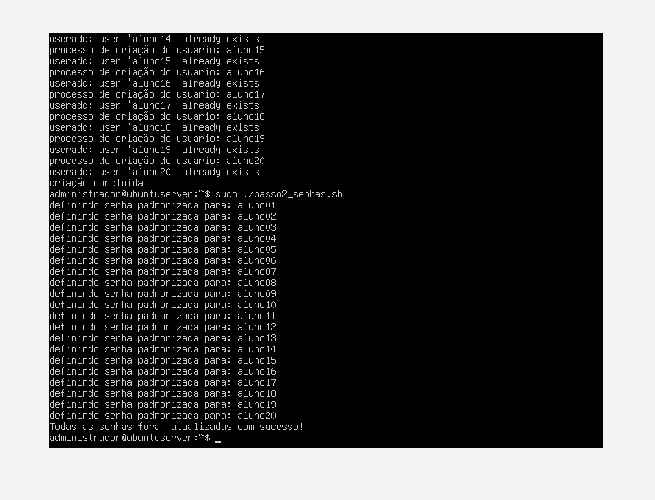
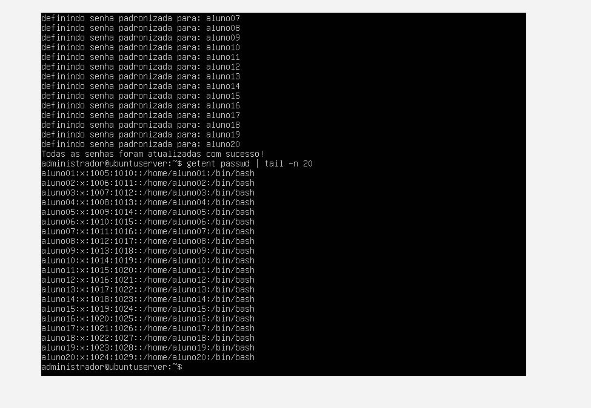
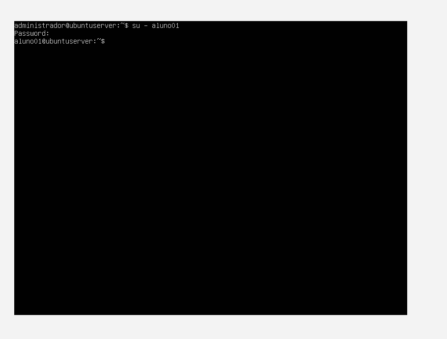

# Relatório Técnico - Aula Prática 04: Manipulação, Edição, Permissões e Automação de Arquivos no Linux

## 1. Identificação
* **Nome do Aluno:** Arthur Soares Silva
* **Curso:** Bacharelado em Sistemas de Informação (BSI)
* **Turma:** Período 9 (2026.02)
* **Data de Execução:** 30/08/2026
* **Título da Prática:** Manipulação, Edição, Permissões e Automação de Arquivos no Linux

---

## 2. Objetivo
Compreender a edição, visualização e manipulação de arquivos de texto no ambiente Linux via terminal. A prática abrangeu o uso de editores de texto (`nano`), comandos de gerenciamento de arquivos (`touch`, `cp`, `mv`, `rm`, `cat`, `less`, `head`, `tail`), o entendimento das permissões de arquivos (em especial a permissão de execução `x`) e a criação de scripts em Shell Script (`passo1_criar.sh` e `passo2_senhas.sh`) para automação do cadastro e gerenciamento de senhas de contas de usuários em lote.

---

## 3. Ambiente
* **Hospedeiro (Host):** Windows 11 Pro
* **Hipervisor:** Oracle VM VirtualBox
* **Sistema Convidado (VM):** Ubuntu Server 26.04 LTS
* **Recursos da VM:** 512 MB de RAM, 1 CPU, 32 GB de Disco VDI
* **Usuário Administrador:** `administrador` (com privilégios `sudo`)

---

## 4. Procedimento

1. **Fundamentos de Manipulação e Edição de Arquivos:**
   * Criação do arquivo `configuracao.conf` via `touch` e edição no `nano` inserindo variáveis de teste (`PORTA=8080`, `TIMEOUT=30`).
   * Criação da pasta `backups/` (`mkdir`), cópia do arquivo de configuração (`cp configuracao.conf backups/`) e renomeação do arquivo original para `config_antiga.conf` (`mv`).
   * Prática de remoção interativa de segurança (`rm -i config_antiga.conf`) e remoção recursiva forçada do diretório de testes (`rm -rf backups`).

2. **Criação da Lista de Usuários (`usuarios.txt`):**
   * Criação do arquivo `usuarios.txt` contendo a relação de 20 contas (`aluno01` a `aluno20`), dispostas individualmente linha a linha.

3. **Automação do Cadastro de Usuários em Lote (`passo1_criar.sh`):**
   * Criação do script de automação em Shell utilizando a estrutura de repetição `for usuario in $(cat usuarios.txt); do ... done`.
   * Execução do comando `useradd -m -s /bin/bash $usuario` para forçar a criação do diretório `/home/usuario` e definir o shell Bash como interpretador padrão.

4. **Automação da Definição de Senhas em Lote (`passo2_senhas.sh`):**
   * Criação do script para padronização de credenciais (onde cada usuário recebe uma senha equivalente ao seu próprio nome de usuário).
   * Uso do utilitário `chpasswd` em pipeline (`echo "$usuario:$usuario" | chpasswd`) para efetuar a gravação direta sem a necessidade de intervenção humana.

5. **Gerenciamento de Permissões e Execução:**
   * Atribuição de permissão de execução aos dois scripts via modo simbólico: `chmod +x passo1_criar.sh` e `chmod +x passo2_senhas.sh`.
   * Execução sequencial dos scripts no terminal com elevação de privilégios (`sudo ./passo1_criar.sh` e `sudo ./passo2_senhas.sh`).

---

## 5. Testes e Evidências

* **Execução dos Scripts de Automação:** Confirmação do processamento da criação dos usuários e da aplicação em lote das senhas padronizadas via `chpasswd`.
  

* **Validação das Contas Criadas (`getent passwd | tail -n 20`):** Retorno confirmado exibindo as 20 contas inseridas na base de dados do sistema, acompanhadas dos seus diretórios de trabalho `/home/alunoXX` e do shell `/bin/bash`.
  

* **Teste de Autenticação e Login Shell (`su - aluno01`):** Realização do login de teste utilizando as credenciais cadastradas, validando a troca de contexto e a entrada no diretório pessoal.
  

---

## 6. Problemas e Soluções

* **Problema 1: Erro de negação de execução (`./passo1_criar.sh: Permission denied`)**
  * *Causa:* Arquivos criados via editores ou comandos comuns no Linux nascem sem a permissão de execução (`x`) ativada por padrão de segurança.
  * *Solução:* Aplicação do comando `chmod +x passo1_criar.sh` para autorizar a execução do arquivo como script.

* **Problema 2: Erro `pam_chauthtok() failed: Authentication token manipulation error` ao definir senhas**
  * *Causa:* Execução do utilitário `chpasswd` sem privilégios de superusuário (`root`), impedindo a alteração do arquivo `/etc/shadow` e causando falha na passagem de dados pelo pipe (`|`).
  * *Solução:* Remoção do `sudo` de dentro do loop do script e execução do script completo via `sudo ./passo2_senhas.sh`.

* **Problema 3: Usuários criados sem pasta pessoal ou acessando o shell `/bin/sh`**
  * *Causa:* Utilização do comando `useradd` de baixo nível sem os parâmetros de configuração de ambiente.
  * *Solução:* Inclusão obrigatória dos parâmetros `-m` (criação automática do `/home`) e `-s /bin/bash` (definição do shell interativo padrão) na linha do script.

---

## 7. Conclusão
A aula prática permitiu vivenciar a importância da manipulação eficiente de arquivos de texto e da automação via Shell Script na administração de sistemas Linux. O uso de comandos como `useradd` e `chpasswd` encadeados em laços `for` demonstra como tarefas administrativas repetitivas podem ser executadas com alta precisão, escalabilidade e produtividade, garantindo a padronização de ambientes corporativos e eliminando falhas operacionais decorrentes de processos manuais.
